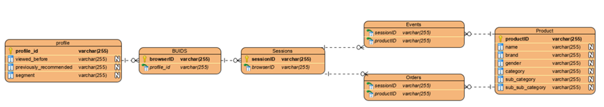
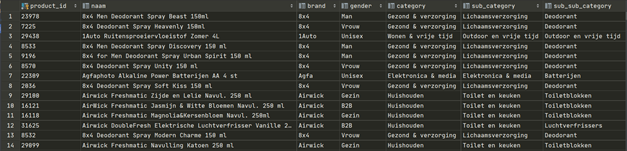
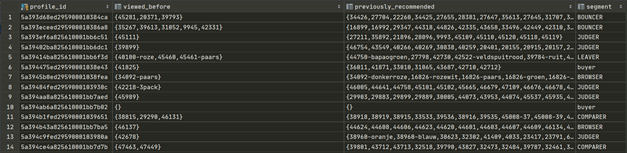
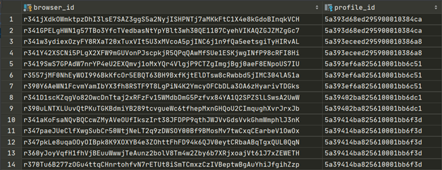
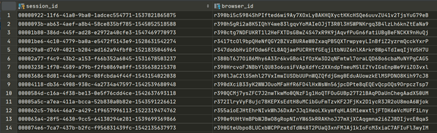
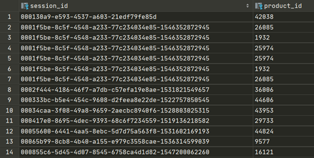
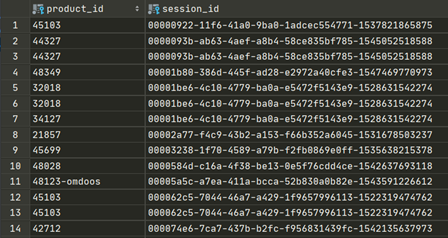

# User story 1: Datakoppeling realiseren

PostgreSQL

| _GP-V1A-Groep 6_ 
| --- |
| 1778763 – Beau Dekker |
| 1778287 – Gaynora van Dommelen  |
| 1779750 – Robin Kroesen |
| 1789287 – Khai-Tam Nguyen |

Voor het opzetten van de database zijn de volgende files nodig:
- rdbconnection2.py
- mdbconnection2.py
- createTables.py
- DataOverzetten2.py

Zorg dat alle files in één map staan. Om de tabellen aan te maken en de relaties tussen de tabellen op te zetten, run je eerst createTables.py. 
Hierna run je DataOverzetten2.py waarmee de tabellen gevuld worden met de data uit mongo.

# Relaties

_Profile – BUIDS_

Profiel heeft 1 of meer browserid&#39;s.

 Een browserid behoort tot één profiel.

_BUIDS – Session_

Een browserid kan 1 of meer sessies bevatten.

 Een sessie hoort bij één browserid.

_Session – Product_

Een sessie kan 1 of meer producten bevatten.

 Een product kan bij 1 of meer sessies horen.

_Session – Orders_

Een sessie kan 0, 1 of meerdere orders bevatten.

 Een order hoort bij één sessie.

_Orders – Product_

Een order kan 0, 1 of meer producten bevatten.

 Een product kan bij 0, 1 of meer orders zitten

# Logistiek datamodel



# DDL Script

```sql
DROP TABLE IF EXISTS Profile CASCADE;
    DROP TABLE IF EXISTS BUIDS CASCADE;
    DROP TABLE IF EXISTS Sessions CASCADE;
    DROP TABLE IF EXISTS Product CASCADE;
    DROP TABLE IF EXISTS Orders CASCADE;
    DROP TABLE IF EXISTS Events CASCADE;

    CREATE TABLE Profile (
    profile_id varchar(255) PRIMARY KEY,
    viewed_before VARCHAR(255)[],
    previously_recommended VARCHAR(255)[],
    segment VARCHAR(50)
    );
    CREATE TABLE BUIDS (
        browser_id varchar(255) PRIMARY KEY,
        profile_id varchar(255),
        FOREIGN KEY (profile_id)
            REFERENCES Profile (profile_id)
    );
    CREATE TABLE Product (
        product_id varchar(255) NOT NULL,
        naam varchar(255),
        brand varchar(255),
        gender varchar(255),
        category varchar(255),
        sub_category varchar(255),
        sub_sub_category varchar(255),
        PRIMARY KEY (product_id)
    );
    CREATE TABLE Sessions (
        session_id varchar(255) PRIMARY KEY,
        browser_id varchar(255),
        FOREIGN KEY (browser_id)
            REFERENCES BUIDS (browser_id)
    );
    CREATE TABLE Orders (
        session_id varchar(255),
        product_id varchar(255),
        FOREIGN KEY (session_id)
            REFERENCES Sessions (session_id),
        FOREIGN KEY (product_id)
            REFERENCES Product (product_id)
    );
    CREATE TABLE Events (
        product_id varchar(255) NOT NULL,
        session_id varchar(255) NOT NULL,
        FOREIGN KEY (product_id)
            REFERENCES Product (product_id),
        FOREIGN KEY (session_id)
            REFERENCES Sessions (session_id)
    );
```
Deze is terug te vinden in &#39;createTables.py&#39;

# Data overzetten

## Connectie maken met MongoDB

Voor het verbinden met mongodb is de volgende functie aangemaakt:
```python
def conmdb():
    try:
        myclient = MongoClient()
        db = myclient["huwebshop"]
        return db
    except pymongo.DatabaseError:
        print("Connection with mongodb failed")
```

Deze is terug te vinden in &#39;mdbconnection2.py&#39;

## Connectie maken met PostgreSQL

Voor de verbinding met postgres is eveneens een functie aangemaakt:

```python
def conrdb():
    try:
        connectionRDB = psycopg2.connect(
            user='postgres',
            password=<ww>,
            host='localhost',
            database='DocumentStore'
        )
        cursor = connectionRDB.cursor()
        return connectionRDB, cursor
    except (Exception, psycopg2.DatabaseError) as e:
        print(e)
```

Deze is terug te vinden in &#39;rdbconnection2.py&#39;

## Overzetting

Voor het overschrijven van de tabellen naar de database in postgres zijn verschillende functies geschreven:

### Product

Omdat de tabel product op zichzelf staat (geen FK&#39;s heeft) wordt deze als eerste ingelezen met behulp van de volgende functie:

```python
def products():
    for element in mdbcur["products"].find():
        temp =[
            element[key]
            if not isinstance(element[key], dict) # ervan uitgaande dat er maar één dict in voorkomt
            else get_subvalue(element[key], None) # neem de values van de sub_keys
            for key in [
                "_id", 
                "name", 
                "brand", 
                "gender", 
                "category", 
                "sub_category", 
                "sub_sub_category"]
            if key in element # Doe bovenstaande als de key bestaat in het document
        ]
        while len(temp) <= 6:
            temp.append(None)
        product_query = "INSERT INTO product VALUES (%s, %s, %s, %s, %s, %s, %s)"
        rdbcur.execute(product_query, temp)
        rdbcon.commit()
```

Voor elke element in de collectie wordt gezocht naar de values van de keys &#39;id&#39;, &#39;name&#39;, &#39;brand&#39;, &#39;gender&#39;, &#39;category&#39;, &#39;sub\_category&#39; en &#39;sub\_sub\_category&#39; als deze bestaan. De worden in een lijst gestopt en evt. aangevuld met &#39;None&#39; als niet alle erin zaten. (In de loop wordt zelf al None toegevoegd als deze niet bestaat, maar alleen als er keys volgen na de specifieke key. Anders wordt geen nieuwe index met None aangemaakt.) Daarna worden de producten naar de rdb geschreven.

### Profile &amp; buids

Na product blijft er één tabel over die op zichzelf staat: Profile.
 Profile en buids worden na elkaar in de rdb gezet, omdat in een document van een profile aangegeven staat welke browserid&#39;s erbij horen en er dan maar één keer door de collectie heen hoeft te worden gelopen. Hiervoor zijn de volgende functies gemaakt:

```python
def profiles():
    profile_var = []
    buids_var = []
    for element in mdbcur["profiles"].find():
        temp =[
            element[key]
            if not isinstance(element[key], dict) # ervan uitgaande dat er maar één dict in voorkomt
            else get_subvalue(element[key], ["segment", "viewed_before"]) # neem de values van de sub_keys
            for key in [
                "_id",
                "buids",
                "recommendations",
                "previously_recommended"]
            if key in element # Doe bovenstaande als de key bestaat in het document
        ]
        try:
            profile_var.append([str(temp[0]), temp[2][1], temp[3], temp[2][0]])
            for browserid in temp[1]:
                buids_var.append([browserid, str(temp[0])])
        except IndexError:
            pass
    profile_query = "INSERT INTO profile VALUES (%s, %s, %s, %s)"
    rdbcur.executemany(profile_query, profile_var)
    rdbcon.commit()
    buids_query = "INSERT INTO buids VALUES (%s, %s) ON CONFLICT (browser_id) DO NOTHING"
    rdbcur.executemany(buids_query, buids_var)
    rdbcon.commit()
```

Zoals misschien al wel is opgevallen lijken de functies products en profiles heel erg op elkaar. Dit komt doordat bij het gebruiken van een functie voor het ophalen van deze values en het stoppen van deze values in een lijst zorgde voor enorme overbelasting van de memory waardoor computers vastliepen. Vandaar de keuze meteen in de loop een insertion te doen en de opbouw van het inlezen van de collectie deels hetzelfde is.

Voor de buids geldt, dat naast het doorheen lopen van de profielen onze tabel berust op FK profile\_id en een browser\_id als PK waardoor door de lijst van de buids gegaan wordt en elk browser\_id gelinkt wordt aan een profile\_id. Deze lijsten worden vervolgens naar de bijbehorende tabellen geschreven.

### Sessions, Orders &amp; Events

Evenals bij de profiles wordt hier één keer door de collectie in mongodb heengelopen en worden lijsten aangemaakt voor de verschillende tabellen waarin de bijbehorende values komen te staan.

```python
def sessions():
    limit = 100000
    skip = 0
    time = 0
    for i in range(0, 34):
        begin_ses_ev_or = perf_counter()

        sessions_var = []
        events_var = []
        orders_var = []
        for element in mdbcur["sessions"].find().skip(skip).limit(limit):
            temp =[
                element[key]
                if not isinstance(element[key], dict) # ervan uitgaande dat er maar één dict in voorkomt
                else get_subvalue(element[key], ["products"]) # neem de values van de sub_keys
                for key in [
                    "_id", 
                    "buid", 
                    "events", 
                    "order"]
                if key in element # Doe bovenstaande als de key bestaat in het document
            ]
            try:
                if temp[3] is not None:
                    if temp[3][0] is not None:
                        for product in temp[3][0]:
                            orders_var.append([product["id"], temp[0], temp[0], product["id"]])
                sessions_var.extend([[temp[1][0], temp[0], temp[1][0]] if not isinstance(temp[1][0], list) else [temp[1][0][0], temp[0], temp[1][0][0]]])
                events_var.extend([
                    [event["product"], temp[0], event["product"], temp[0]]
                    if " " not in event["product"]
                    else [event["product"].split(" ")[0], temp[0], event["product"].split(" ")[0], temp[0]]
                    for event in temp[2]
                    if "product" in event and event["product"] is not None
                ])
            except IndexError:
                pass
            
        events_var = [event for event in events_var if event]

        sessions_query = "DO $$ BEGIN IF (SELECT EXISTS (SELECT browser_id FROM buids WHERE browser_id=%s)::int) THEN INSERT INTO sessions VALUES (%s, %s); END IF; END $$;"
        orders_query = "DO $$ BEGIN IF (SELECT EXISTS (SELECT product_id FROM product WHERE product_id=%s)::int) THEN IF(SELECT EXISTS (SELECT session_id FROM sessions WHERE session_id=%s)::int) THEN INSERT INTO orders VALUES (%s, %s); END IF; END IF; END $$;"
        events_query = "DO $$ BEGIN IF (SELECT EXISTS (SELECT product_id FROM product WHERE product_id=%s)::int) THEN IF(SELECT EXISTS (SELECT session_id FROM sessions WHERE session_id=%s)::int) THEN INSERT INTO events VALUES (%s, %s); END IF; END IF; END $$;"

        rdbcur.executemany(sessions_query, sessions_var)
        rdbcon.commit()
        rdbcur.executemany(orders_query, orders_var)
        rdbcon.commit()
        rdbcur.executemany(events_query, events_var)
        rdbcon.commit()

        skip += limit
```

Wat bij deze functie extra is, is de iteratieve manier van documenten inlezen. Voor deze versie deden we dat eerst ineenkeer wat een memory error opleverde en daarna op een recursieve manier waardoor we nog steeds een memory error kregen, daarom is gekozen voor iteratief. Voor deze functie is uniek dat bij het inserten van een row eerst gekeken wordt of de bijbehorende FK&#39;s bestaan, omdat sommige sessions geen bestaande browser\_id hadden in onze tabel buids. Wat als gevolg had dat niet alle sessies bestonden en dus ook op sessies gecheckt moest worden. Daarnaast bestonden sommige product\_id&#39;s niet die voorkwamen in events en/of orders waardoor er bij het invoegen van deze gegegevens in de tabel – naast de session\_id – ook gekeken moest worden naar product\_id.

De code is terug te vinden in &#39;DataOverzetten2.py&#39;.

## De tabellen

D.m.v. van een simpele query als

```sql
select * from <tabel_naam>;
```

zijn de volgende tabellen opgehaald:

### Product



### Profile



### Buids



### Session



### Orders



### Events


