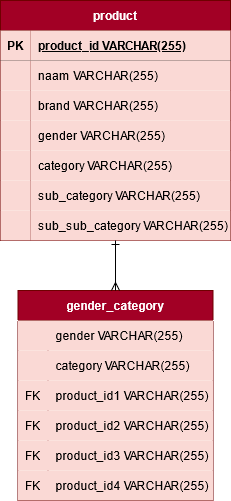
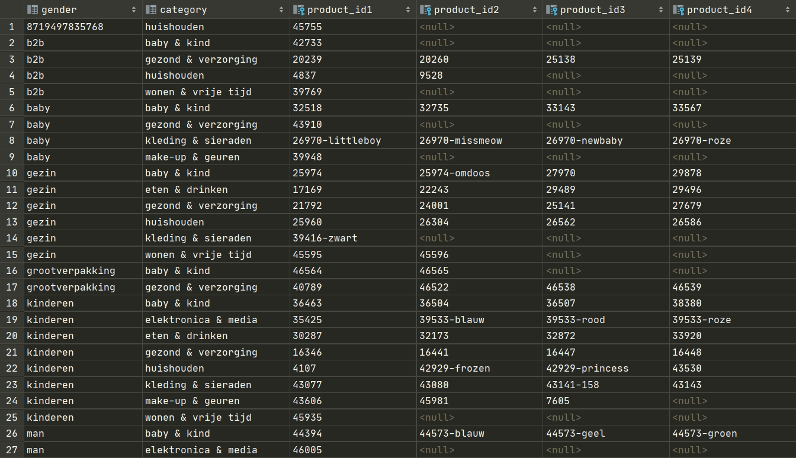
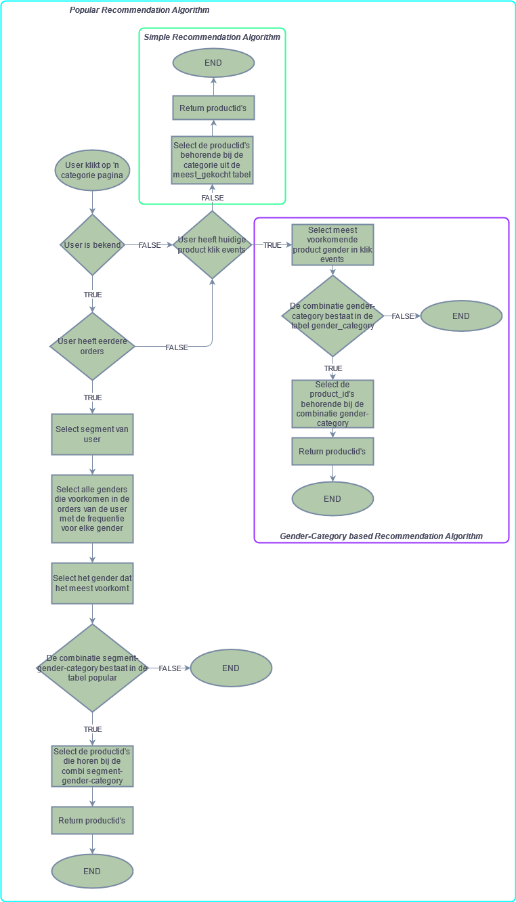
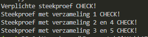

# User story 4: Popular recommendation

Anderen kochten ook

Op de productoage van het front-end staat een kopje: 'Anderen kochten ook'. Hier worden de producten geplaatst van profielen die hetzelfde koopgedrag als de user vertonen, 
in dezelfde geslachtscategorie zitten als de gebruiker en passen bij de categorie van de pagina.

| _GP-V1A-Groep6_
| --- |
| TAAI-V1GP-19_2020 |
| TICT-AI-V1A |
| 1778287 |

# Onderbouwing algoritme

Omdat de aanbevelingen zijn gebaseerd op eerdere aankopen van andere mensen, wordt gekeken naar mensen die eerder orders hebben gedaan.


Het **U**niversum van het Venn-diagram hierboven bestaat uit klanten. Deze verzameling klanten kan **B**ekend zijn of (B̅) niet bekend zijn. 
Van alle profielen van bekende klanten, heeft een groep **E**vents. Daarnaast heeft een groep mensen met Events ook **O**rders. 
Voor elk **S**egment binnen deze verzameling wordt vervolgens gekeken naar de producten die door deze groep profielen zijn gekocht. 
Vervolgens wordt gekeken naar de verschillende **G**enders binnen ’n verzameling segment x waardoor de combinatie segment-gender ontstaat voor elke mogelijke gender binnen de verzameling van segment x. 
En om met elke **C**ategorie product pagina verschillende producten te tonen, verdelen we de verzameling van producten in segment x, gender y op categorieën. 


## Huidige user behoort tot B

Deze groep kan vervolgens verder worden onderverdeeld. Welke mensen vertonen hetzelfde koopgedrag als de user? Hiervoor wordt gekeken naar het segment dat bij een profiel hoort. 
Voor elke verzameling profielen bij ‘n segment geldt: _segment_ is een subset van _O_. Wat voor segmenten zijn er, en hoe vaak komen profielen met een bepaald segment voor?

```sql
select lower(segment), count(segment) as frequency
from profile
group by lower(segment)
order by lower(segment);
```


Als we hier zouden stoppen, dan zouden mensen die alleen vrouwelijke producten kopen ook mannelijke producten (of andersom, etc.) aangeboden krijgen.
Daarom wordt voor alle aankopen van de profielen bij 'n segment x gekeken naar 'n gender y.
Dus als we nu gaan kijken voor 'n segment: browser wat de distributie is van genders binnen de verzameling orders van dit segment dan krijgen we het volgende:


```sql
select lower(gender) as gender, count(*) as frequency from product
natural join(select product_id from orders
natural join(select * from sessions
natural join(select browser_id from buids
natural join profile where lower(segment)='browser')
as _id) as __id) as ___id
group by lower(gender)
order by lower(gender);
```


Als we nu gaan kijken naar de frequencies van producten voor elke mogelijke combinatie van gender-category binnen de verzameling orders van profielen met het segment browser,
krijgen we de volgende uitkomst:

```sql
select lower(gender) as gender, lower(category) as category, count(*) as frequency from product
natural join(select product_id from orders
natural join(select * from sessions
natural join(select browser_id from buids
natural join profile where lower(segment)='browser')
as _id) as __id) as ___id
group by lower(gender), lower(category)
order by lower(gender), lower(category);
```


Hierboven is de tabel getoond met de eerste 29 rijen van de in totaal 70 rijen. 
Hier kun je zien dat elke verzameling van producten voor 'n segment browser met gender x alle producten zijn onderverdeeld in categorieën die voorkomen binnen de verzameling producten.
Dan zie je ook dat verzamelingen als grootverpakking minder combinaties hebben. Blijkbaar komen binnen de verzameling van grootverpakking slechts twee categorieën voor.

Ook zien we dat sommige combinaties, niet voorkomen of maar 1 product bevatten zoals; gender: gezin, category: kleding & sieraden. Dit betekent dat bij een user met
het gedrag van een browser, gender kenmerk grootverpakking op de pagina van kleding & sieraden, maar 1 product krijgt aangeraden. Of soms geen enkel product als de category niet voorkomt
in de gekochte producten.

### Nuttigheid

Door het sorteren op segment kenmerk, gender kenmerk en vervolgens per categoriepagina
zou je kunnen zeggen dat mensen die dezelfde kenmerken als een user hadden statistisch gezien grotendeels hetzelfde gedrag zullen vertonen als de gebruiker. 
Neem bijvoorbeeld segment: browser en het gender kenmerk baby. Dan is de kans heel groot dat ze naar de categorie pagina van baby & kind kijken
waar ook de meeste producten van zijn gekocht. En dus volgt dan indirect dat ze minder of vrijwel niet naar de pagina gezond & verzorging zullen kijken 
en dat het tonen van minder recommendations voor die pagina daarom gerechtvaardigd is.

### Pseudocode

```python
Creëer tabel popular als deze nog niet bestond met de kolommen segment, gender, category, FK product_id1, FK product_id2, FK product_id3, FK product_id4. 

Voor elk _segment in lijst met segments loop: 
    Stop alle mogelijke gender-category combinaties binnen de verzameling met producten, de orders van profielen met segment _segment in een lijst seg. 
    Voor elke _gender_category combinatie in seg loop: 
        Stop de eerste vijf producten binnen de verzameling producten uit de orders van profielen met segment _segment, die voldoen aan de _gender_category combinatie in een lijst prodids. 

        Voeg achtereenvolgens de volgende delen in de tabel in: 		segment, gender, category, prodids[0], prodids[1], 		prodids[2], prodids[3]

```

### Relations

_Product_ -- _Popular_

Een product kan bij **0 of 1** rij horen van popular.

Een rij van popular hoort bij **meerdere** producten.

### Logistiek Datamodel


### DDL

Hieronder volgt de query die wordt uitgevoerd in createRelationTables.py om de relatie tussen de tabel popular en product te maken.

```sql
DO $$
DECLARE
    _segment VARCHAR;
    i INT;
    index INT;
    r RECORD;
    clean_list VARCHAR[];
    _combi VARCHAR[];
    prod_freq_list VARCHAR[];
    prod_freq VARCHAR[];
    temp VARCHAR[];
    temp2 INT[];
    temp3 INT[];
BEGIN
    -- [ MAAK DE TABEL AAN OF UPDATE DE TABEL ]
    DROP TABLE IF EXISTS popular CASCADE;
    CREATE TABLE popular (
        segment VARCHAR(255),
        gender VARCHAR(255),
        category VARCHAR(255),
        product_id1 VARCHAR(255),
        product_id2 VARCHAR(255),
        product_id3 VARCHAR(255),
        product_id4 VARCHAR(255),
        FOREIGN KEY (product_id1)
                REFERENCES product (product_id),
        FOREIGN KEY (product_id2)
                REFERENCES product (product_id),
        FOREIGN KEY (product_id3)
                REFERENCES product (product_id),
        FOREIGN KEY (product_id4)
                REFERENCES product (product_id)
    );
    -- [ VUL DE TABEL ]
    ------------------------- || Voor elk segment bestaande binnen profielen
    foreach _segment in ARRAY(select array(select lower(segment) as segment
                                from profile
                                group by lower(segment)
                                order by lower(segment))) loop
        ------------------------ || Groepeer elke mogelijk combinatie gender-categorie van producten
        ------------------------ || gekocht door profielen met het segment _segment
        foreach _combi slice 1 in ARRAY(select array(select array[lower(gender), lower(category)] from product
                                        natural join(select product_id from orders
                                        natural join(select * from sessions
                                        natural join(select browser_id from buids
                                        natural join profile where lower(segment)=_segment)
                                        as _id) as __id) as ___id
                                        group by lower(gender), lower(category)
                                        order by lower(gender), lower(category))) loop
            if _combi[1] is not Null and _combi[2] is not Null then -- || Als zowel het gender als de categorie niet Null zijn
                ----------------------- || Neem dan de producten
                prod_freq_list := array(select ARRAY[product_id, count(*)::varchar] from product
                                        natural join(select product_id from orders
                                        natural join(select * from sessions
                                        natural join(select browser_id from buids
                                        natural join profile where lower(segment)=_segment)
                                        as _id) as __id) as ___id
                                        where lower(gender)=_combi[1] and lower(category)=_combi[2]
                                        group by product_id
                                        order by product_id);
            else -- || Als het gender Null is en de categorie niet
                if _combi[1] is Null and _combi[2] is not Null then
                    prod_freq_list := array(select ARRAY[product_id, count(*)::varchar] from product
                                        natural join(select product_id from orders
                                        natural join(select * from sessions
                                        natural join(select browser_id from buids
                                        natural join profile where lower(segment)=_segment)
                                        as _id) as __id) as ___id
                                        where lower(gender) is Null and lower(category)=_combi[2]
                                        group by product_id
                                        order by product_id);
                else -- || Categorie Null bestaat niet op de front-end en is dus overbodig voor de tabel
                    continue;
                end if;
            end if;
            temp := ARRAY[Null];
            temp2 := ARRAY[Null];
            foreach prod_freq slice 1 in array(prod_freq_list) loop
                    temp = array_append(temp, prod_freq[1]);
                    temp2 = array_append(temp2, prod_freq[2]::int);
            end loop;
            temp3 = ARRAY(select distinct unnest(temp2) order by 1);
            if array_length(temp3, 1) > 1 then
                for i in 1..4 loop
                    for r in select max(x) as f from unnest(temp2) as x loop
                            index = array_position(temp2, r.f);
                            clean_list[i] = temp[index];
                            temp = array_remove(temp, temp[index]);
                    end loop;
                end loop;
                if clean_list[1] is not Null then
                    INSERT INTO popular VALUES (_segment, _combi[1], _combi[2], clean_list[1], clean_list[2], clean_list[3], clean_list[4]);
                else
                    continue;
                end if;
            end if;
        end loop;
    end loop;
END $$;
```

### Tabel Popular


## Huidige user behoort tot O̅

Voor de groep onbekende mensen evenals voor de groep bekende mensesen zonder orders wordt gekeken naar of ze huidige klik events hebben.

Als users huidige klik events hebben, dan wordt gekeken naar het meestvoorkomende gender in de producten. Vervolgens wordt op basis van dit kenmerk samen met de categoriepagina waarop een user zich begeeft recommendations gegeven. Dan is er gekeken naar welke producten horen bij het gender profiel van de user en is gebruik gemaakt van collaborative filtering. 

### Pseudocode 
```python
Creëer tabel gender_category als deze nog niet bestond met de kolommen gender, category, FK product_id1, FK product_id2, FK product_id3, FK product_id4. 
Voor elke _gender_category combinatie in orders loop: 
    Stop de vijf meestvoorkomende producten binnen de verzameling _gender_category, in een lijst prodids. 

    Voeg achtereenvolgens de volgende delen in de tabel in:	gender, category, prodids[0], prodids[1], prodids[2], prodids[3]
```

### Relations

_Product_ -- *gender_category*

Een product kan bij **0 of 1** rij horen van popular.

Een rij van popular hoort bij **meerdere** producten.

### Logistiek Datamodel



### DDL

```sql
DO $$
DECLARE
    _gender_category_combi VARCHAR[];
    _prod_freq_list VARCHAR[];
    _prod_freq VARCHAR[];
    _clean_list VARCHAR[];
    _prod_list VARCHAR[];
    _freq_list INT[];
    _unique_freqs INT[];
    index INT;
    i INT;
    r RECORD;
BEGIN
    -------------------[ MAAK OF UPDATE DE FILTER TABEL ]
    DROP TABLE IF EXISTS gender_category CASCADE;
    CREATE TABLE gender_category(
        gender VARCHAR(255),
        category VARCHAR(255),
        product_id1 VARCHAR(255),
        product_id2 VARCHAR(255),
        product_id3 VARCHAR(255),
        product_id4 VARCHAR(255),
        FOREIGN KEY (product_id1)
                REFERENCES product(product_id),
        FOREIGN KEY (product_id2)
                REFERENCES product(product_id),
        FOREIGN KEY (product_id3)
                REFERENCES product(product_id),
        FOREIGN KEY (product_id4)
                REFERENCES product(product_id)
    );
    -- Voor elke gender-categorie combie in de verzameling orders
    foreach _gender_category_combi slice 1 in array(select array(select array[lower(gender), lower(category)] from orders
                                                    natural join product
                                                    group by lower(gender), lower(category))) loop
        -- Groupeer de producten die in deze gender-categorie verzameling horen met de frequentie voor elk product
        if _gender_category_combi[2] is not Null then
            if _gender_category_combi[1] is Null then
                _prod_freq_list := array(select array(select array[product_id, count(*)::varchar] from orders
                                         natural join product
                                         where lower(gender) is Null
                                         and lower(category)=_gender_category_combi[2]
                                         group by product_id));
            else
                _prod_freq_list := array(select array(select array[product_id, count(*)::varchar] from orders
                                         natural join product
                                         where lower(gender)=_gender_category_combi[1]
                                         and lower(category)=_gender_category_combi[2]
                                         group by product_id));
            end if;
            _prod_list := ARRAY[Null];
            _freq_list := ARRAY[Null];
            foreach _prod_freq slice 1 in ARRAY(_prod_freq_list) loop
                _prod_list = array_append(_prod_list, _prod_freq[1]);
                _freq_list = array_append(_freq_list, _prod_freq[2]::int);
            end loop;
            _unique_freqs = ARRAY(select distinct unnest(_freq_list) order by 1);
            if array_length(_unique_freqs, 1) > 1 then
                for i in 1..4 loop -- Neem de 4 meestvoorkomende producten als recommendations
                    for r in select max(x) as f from unnest(_freq_list) as x loop
                            index = array_position(_freq_list, r.f);
                            _clean_list[i] = _prod_list[index];
                            _prod_list = array_remove(_prod_list, _prod_list[index]);
                    end loop;
                end loop;
                if _clean_list[1] is not Null then -- Stop deze recommendations in de tabel
                    INSERT INTO gender_category VALUES (_gender_category_combi[1],
                                                        _gender_category_combi[2],
                                                        _clean_list[1],
                                                        _clean_list[2],
                                                        _clean_list[3],
                                                        _clean_list[4]);
                else
                    CONTINUE;
                end if;
            end if;
        end if;
    end loop;
END $$;
```

### Tabel gender_category



Maar wat nou als een user geen huidige klik events heeft? 

Omdat er voor deze mogelijkheid geen relevante user informatie is, wordt gebruik gemaakt van de [_simple recommendation_](https://github.com/beaupd/AI-GP-V1A-Projectgroep_6/blob/main/user_story_3/readme.md). Als een user dan op een categoriepagina klikt, worden de meest verkochte producten in die categorie getoond.

# Hoe werkt de recommendation?



# Validatie Algoritme

Er zijn in totaal 5 mogelijke users: 

1). User is bekend en heeft orders 

2). User is bekend en heeft geen eerdere orders en geen huidige klik events 

3). User is bekend en heeft geen eerdere orders en wél huidige klik events 

4). User is onbekend en heeft geen huidige klik events 

5). User is onbekend en heeft wél huidige klik events 

Verzameling 1 kan verder worden onderverdeeld in profielen met overduidelijke mannelijke, vrouwen en unisex producten. Voor elk van deze sub verzamelingen zijn 4 profielen getest. 
Voor de verzamelingen 2,3,4 en 5 zijn 4 profielen getest. 
Daarnaast is er voor elk profiel gekeken naar de categoriepagina’s: ‘gezond & verzorging’ en ‘wonen & vrije tijd’.  
Verder werd voor de verzamelingen 3 en 5 gebruik gemaakt van drie mogelijke gender verhoudingen qua producten: (1) man:2, vrouw:1, unisex:1, (2) man:1, vrouw:2, unisex:1 en (3) man:1, vrouw:1, unisex:2. 
Deze dienden als de huidige klik events. 

Voor elke combinatie die hieruit ontstaat: 

- Bekend profiel, met eerdere orders, categorie ‘gezond & verzorging’ en daarna ‘wonen & vrije tijd’ voor elk profiel in verzameling 1 

- Bekend/onbekend profiel zonder orders en klik events voor categorie ‘gezond & verzorging’ en daarna ‘wonen & vrije tijd’ voor elke profiel in verzameling 3 en 5. 

- Bekend/onbekend profiel zonder orders en mét klik events voor categorie ‘gezond & verzorging’ voor ‘product verhouding (1)’, ‘product verhouding (2)’ en product verhouding (3). En dit vervolgens opnieuw met de categorie ‘wonen & vrije tijd’ voor elk profiel in de verzamelingen 2 en 4. 

Hieruit kwam dat alle recommendations logistiek en technisch gezien overeenkomen met de verwachtingen bij de gegeven input.  

Dus bij een **bekend** profiel met segment: **browser**, gender: **man** en categoriepagina: **gezond & verzorging** werd producten aanbevolen die vallen onder gender: man en category: gezond & verzorging en eerder gekocht zijn door mensen met het segment browser. En werd bij een **onbekend** profiel **zonder huidige klik events** op de categoriepagina: **wonen & vrije tijd** producten aanbevolen die vallen onder category: wonen & vrije tijd en het meest gekocht zijn. Daarnaast werd bij een **bekend** profiel **zonder orders** en **met huidige klik events**, waarbij het meest gebruikte gender: **vrouw** is op de categoriepagina: **wonen & vrije tijd**, producten aangeboden die vallen onder het gender vrouw en categorie wonen & vrije tijd. 



Zie [_popular_validation_](https://github.com/beaupd/AI-GP-V1A-Projectgroep_6/blob/main/user_story_4/popular/popular_validation.py) voor de validatie.
